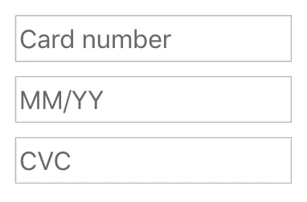

# React Payment Inputs

> A React Hook & Container to help with payment card input fields.


<p align="center"></img></p>

<p align="center"></img></p>

- [React Payment Inputs](#react-payment-inputs)
  - [Demos](#demos)
  - [Requirements](#requirements)
  - [Installation](#installation)
  - [Usage](#usage)
    - [With hooks](#with-hooks)
    - [With render props](#with-render-props)
    - [Using the built-in styled wrapper](#using-the-built-in-styled-wrapper)
    - [More examples](#more-examples)
  - [`data = usePaymentInputs(options)`](#data--usepaymentinputsoptions)
    - [options](#options)
      - [options.cardNumberValidator](#optionscardnumbervalidator)
        - [Example](#example)
      - [options.cvcValidator](#optionscvcvalidator)
      - [options.errorMessages](#optionserrormessages)
        - [Example](#example-1)
      - [options.expiryDateValidator](#optionsexpirydatevalidator)
      - [options.onBlur](#optionsonblur)
      - [options.onChange](#optionsonchange)
      - [options.onError](#optionsonerror)
      - [options.onTouch](#optionsontouch)
    - [`data`](#data)
      - [getCardNumberProps](#getcardnumberprops)
        - [Example snippet](#example-snippet)
      - [getExpiryDateProps](#getexpirydateprops)
        - [Example snippet](#example-snippet-1)
      - [getCVCProps](#getcvcprops)
        - [Example snippet](#example-snippet-2)
      - [getZIPProps](#getzipprops)
        - [Example snippet](#example-snippet-3)
      - [getCardImageProps](#getcardimageprops)
        - [Example snippet](#example-snippet-4)
      - [meta.cardType](#metacardtype)
        - [Example snippet](#example-snippet-5)
      - [meta.error](#metaerror)
        - [Example snippet](#example-snippet-6)
      - [meta.isTouched](#metaistouched)
      - [meta.erroredInputs](#metaerroredinputs)
        - [Example snippet](#example-snippet-7)
      - [meta.touchedInputs](#metatouchedinputs)
        - [Example snippet](#example-snippet-8)
      - [meta.focused](#metafocused)
      - [wrapperProps](#wrapperprops)
  - [`<PaymentInputsWrapper>` props](#paymentinputswrapper-props)
    - [styles](#styles)
      - [Schema](#schema)
    - [errorTextProps](#errortextprops)
    - [inputWrapperProps](#inputwrapperprops)
  - [Using a third-party UI library](#using-a-third-party-ui-library)
    - [Fannypack](#fannypack)
    - [Bootstrap](#bootstrap)
  - [Form library examples](#form-library-examples)
    - [Formik](#formik)
    - [React Final Form](#react-final-form)
  - [Customising the in-built style wrapper](#customising-the-in-built-style-wrapper)
  - [Custom card images](#custom-card-images)
  - [License](#license)

## [Demos](https://medipass.github.io/react-payment-inputs)

## Requirements

Ensure you are running on a hooks-compatible version of React (v16.8 & above).

## Installation

```
npm install react-payment-inputs --save
```

or install with [Yarn](https://yarnpkg.com) if you prefer:

```
yarn add react-payment-inputs
```

## Usage

<p align="center"></img></p>

By default (as seen above), React Payment Inputs does not come with built-in styling meaning that you can easily adapt React Payment Inputs to your own design system.

However, if you would like to use the built-in styles as seen in the animation above, [read "Using the built-in styled wrapper"](#using-the-built-in-styled-wrapper).

### With hooks

If you'd like to use the hooks version of React Payment Inputs, you can import `usePaymentInputs` into your component.

```jsx
import React from 'react';
import { usePaymentInputs } from 'react-payment-inputs';

export default function PaymentInputs() {
  const { meta, getCardNumberProps, getExpiryDateProps, getCVCProps } = usePaymentInputs();

  return (
    <div>
      <input {...getCardNumberProps({ onChange: handleChangeCardNumber })} value={cardNumber} />
      <input {...getExpiryDateProps({ onChange: handleChangeExpiryDate })} value={expiryDate} />
      <input {...getCVCProps({ onChange: handleChangeCVC })} value={cvc} />
      {meta.isTouched && meta.error && <span>Error: {meta.error}</span>}
    </div>
  );
}
```

> By spreading the prop getter functions (e.g. `{...getCardNumberProps()}`) on the inputs as shown above, React Payment Inputs will automatically handle the formatting, focus & validation logic for you.

> **IMPORTANT:** You must place your event handlers (e.g. `onChange`, `onBlur`, etc) inside the prop getter function (e.g. `getCardNumberProps()`) so the default event handlers in React Payment Inputs don't get overridden.

### With render props

If you'd like to use the render props version of React Payment Inputs, you can import `PaymentInputsContainer` into your component.

The **props** of `<PaymentInputsContainer>` are the same as the hook [options](#options) and the **render props** are the same as the hook [data](#data).

```jsx
import React from 'react';
import { PaymentInputsContainer } from 'react-payment-inputs';

export default function PaymentInputs() {
  return (
    <PaymentInputsContainer>
      {({ meta, getCardNumberProps, getExpiryDateProps, getCVCProps }) => (
        <div>
          <input {...getCardNumberProps({ onChange: handleChangeCardNumber })} value={cardNumber} />
          <input {...getExpiryDateProps({ onChange: handleChangeExpiryDate })} value={expiryDate} />
          <input {...getCVCProps({ onChange: handleChangeCVC })} value={cvc} />
          {meta.isTouched && meta.error && <span>Error: {meta.error}</span>}
        </div>
      )}
    </PaymentInputsContainer>
  );
}
```

> **IMPORTANT:** You must place your event handlers (e.g. `onChange`, `onBlur`, etc) inside the prop getter function (e.g. `getCardNumberProps()`) so the default event handlers in React Payment Inputs don't get overridden.

### Using the built-in styled wrapper

> Note: `<PaymentInputsWrapper>` requires [styled-components](https://styled-components.com) to be installed as a dependency.

By default, React Payment Inputs does not have built-in styling for it's inputs. However, React Payment Inputs comes with a styled wrapper which combines the card number, expiry & CVC fields seen below:

<p align="center"></img></p>

```jsx
import React from 'react';
import { PaymentInputsWrapper, usePaymentInputs } from 'react-payment-inputs';
import images from 'react-payment-inputs/images';

export default function PaymentInputs() {
  const {
    wrapperProps,
    getCardImageProps,
    getCardNumberProps,
    getExpiryDateProps,
    getCVCProps
  } = usePaymentInputs();

  return (
    <PaymentInputsWrapper {...wrapperProps}>
      <svg {...getCardImageProps({ images })} />
      <input {...getCardNumberProps()} />
      <input {...getExpiryDateProps()} />
      <input {...getCVCProps()} />
    </PaymentInputsWrapper>
  );
}
```

### More examples

- [Storybook](https://medipass.github.io/react-payment-inputs)
  - [Source](./stories/index.stories.js)

## `data = usePaymentInputs(options)`

> returns [an object (`data`)](#data)

### options

> `Object({ cardNumberValidator, cvcValidator, errorMessages, expiryValidator, onBlur, onChange, onError, onTouch  })`

#### options.cardNumberValidator
> `function({cardNumber, cardType, errorMessages})`

Set custom card number validator function

##### Example

```js
const cardNumberValidator = ({ cardNumber, cardType, errorMessages }) => {
  if (cardType.displayName === 'Visa' || cardType.displayName === 'Mastercard') {
    return;
  }
  return 'Card must be Visa or Mastercard';
}

export default function MyComponent() {
  const { ... } = usePaymentInputs({
    cardNumberValidator
  });
}
```

#### options.cvcValidator
> `function({cvc, cardType, errorMessages})`

Set custom cvc validator function


#### options.errorMessages

> `Object`

Set custom error messages for the inputs.

##### Example

```js
const ERROR_MESSAGES = {
  emptyCardNumber: 'El número de la tarjeta es inválido',
  invalidCardNumber: 'El número de la tarjeta es inválido',
  emptyExpiryDate: 'La fecha de expiración es inválida',
  monthOutOfRange: 'El mes de expiración debe estar entre 01 y 12',
  yearOutOfRange: 'El año de expiración no puede estar en el pasado',
  dateOutOfRange: 'La fecha de expiración no puede estar en el pasado',
  invalidExpiryDate: 'La fecha de expiración es inválida',
  emptyCVC: 'El código de seguridad es inválido',
  invalidCVC: 'El código de seguridad es inválido'
}

export default function MyComponent() {
  const { ... } = usePaymentInputs({
    errorMessages: ERROR_MESSAGES
  });
}
```

#### options.expiryDateValidator
> `function({expiryDate, errorMessages})`

Set custom expiry date validator function


#### options.onBlur

> `function(event)`

Function to handle the blur event on the inputs. It is invoked when any of the inputs blur.

#### options.onChange

> `function(event)`

Function to handle the change event on the inputs. It is invoked when any of the inputs change.

#### options.onError

> `function(error, erroredInputs)`

Function to invoke when any of the inputs error.

#### options.onTouch

> `function(touchedInput, touchedInputs)`

Function to invoke when any of the inputs are touched.

### `data`

#### getCardNumberProps

> `function(overrideProps)` | returns `Object<props>`

Returns the props to apply to the **card number** input.

**IMPORTANT:** You must place your event handlers (e.g. `onChange`, `onBlur`, etc) inside the `getCardNumberProps()` so the default event handlers in React Payment Inputs don't get overridden.

##### Example snippet

```jsx
<input {...getCardNumberProps({ onBlur: handleBlur, onChange: handleChange })} />
```

#### getExpiryDateProps

> `function(overrideProps)` | returns `Object<props>`

Returns the props to apply to the **expiry date** input.

**IMPORTANT:** You must place your event handlers (e.g. `onChange`, `onBlur`, etc) inside the `getExpiryDateProps()` so the default event handlers in React Payment Inputs don't get overridden.

##### Example snippet

```jsx
<input {...getExpiryDateProps({ onBlur: handleBlur, onChange: handleChange })} />
```

#### getCVCProps

> `function(overrideProps)` | returns `Object<props>`

Returns the props to apply to the **CVC** input.

**IMPORTANT:** You must place your event handlers (e.g. `onChange`, `onBlur`, etc) inside the `getCVCProps()` so the default event handlers in React Payment Inputs don't get overridden.

##### Example snippet

```jsx
<input {...getCVCProps({ onBlur: handleBlur, onChange: handleChange })} />
```

#### getZIPProps

> `function(overrideProps)` | returns `Object<props>`

Returns the props to apply to the **ZIP** input.

**IMPORTANT:** You must place your event handlers (e.g. `onChange`, `onBlur`, etc) inside the `getZIPProps()` so the default event handlers in React Payment Inputs don't get overridden.

##### Example snippet

```jsx
<input {...getZIPProps({ onBlur: handleBlur, onChange: handleChange })} />
```

#### getCardImageProps

> `function({ images })` | returns `Object<props>`

Returns the props to apply to the **card image** SVG.

This function only supports SVG elements currently. If you have a need for another format, please raise an issue.

You can also supply [custom card images](#custom-card-images) using the `images` attribute. The example below uses the default card images from React Payment Inputs.

##### Example snippet

```jsx
import images from 'react-payment-inputs/images';

<svg {...getCardImageProps({ images })} />
```

#### meta.cardType

> Object

Returns information about the current card type, including: name, lengths and formats.

##### Example snippet

```jsx
const { meta } = usePaymentInputs();

<span>Current card: {meta.cardType.displayName}</span>
```

#### meta.error

> string

Returns the current global error between all rendered inputs.

##### Example snippet

```jsx
const { meta } = usePaymentInputs();

console.log(meta.error); // "Card number is invalid"
```

#### meta.isTouched

> boolean

Returns the current global touched state between all rendered inputs.

#### meta.erroredInputs

> Object

Returns the error message of each rendered input.

##### Example snippet

```jsx
const { meta } = usePaymentInputs();

console.log(meta.erroredInputs);
/*
{
  cardNumber: undefined,
  expiryDate: 'Enter an expiry date',
  cvc: 'Enter a CVC'
}
*/
```

#### meta.touchedInputs

> Object

Returns the touch state of each rendered input.

##### Example snippet

```jsx
const { meta } = usePaymentInputs();

console.log(meta.touchedInputs);
/*
{
  cardNumber: true,
  expiryDate: true,
  cvc: false
}
*/
```

#### meta.focused

> string

Returns the current focused input.

```jsx
const { meta } = usePaymentInputs();

console.log(meta.focused); // "cardNumber"
```

#### wrapperProps

> Object

Returns the props to apply to `<PaymentInputsWrapper>`.

## `<PaymentInputsWrapper>` props

### styles

> Object

Custom styling to pass through to the wrapper. Either a styled-component's `css` or an Object can be passed.

#### Schema

```
{
  fieldWrapper: {
    base: css | Object,
    errored: css | Object
  },
  inputWrapper: {
    base: css | Object,
    errored: css | Object,
    focused: css | Object
  },
  input: {
    base: css | Object,
    errored: css | Object,
    cardNumber: css | Object,
    expiryDate: css | Object,
    cvc: css | Object
  },
  errorText: {
    base: css | Object
  }
}
```

### errorTextProps

> Object

Custom props to pass to the error text component.

### inputWrapperProps

> Object

Custom props to pass to the input wrapper component.

## Using a third-party UI library

React Payment Inputs allows you to integrate into pretty much any React UI library. Below are a couple of examples of how you can fit React Payment Inputs into a UI library using `usePaymentInputs`. You can also do the same with `<PaymentInputsContainer>`.

### Fannypack

<p align="center"></img></p>

```jsx
import React from 'react';
import { FieldSet, InputField } from 'fannypack';
import { usePaymentInputs } from 'react-payment-inputs';
import images from 'react-payment-inputs/images';

export default function PaymentInputs() {
  const {
    meta,
    getCardNumberProps,
    getExpiryDateProps,
    getCVCProps
  } = usePaymentInputs();
  const { erroredInputs, touchedInputs } = meta;

  return (
    <FieldSet isHorizontal>
      <InputField
        // Here is where React Payment Inputs injects itself into the input element.
        {...getCardNumberProps()}
        placeholder="0000 0000 0000 0000"
        label="Card number"
        inputRef={getCardNumberProps().ref}
        // You can retrieve error state by making use of the error & touched attributes in `meta`.
        state={erroredInputs.cardNumber && touchedInputs.cardNumber ? 'danger' : undefined}
        validationText={touchedInputs.cardNumber && erroredInputs.cardNumber}
        maxWidth="15rem"
      />
      <InputField
        {...getExpiryDateProps()}
        label="Expiry date"
        inputRef={getExpiryDateProps().ref}
        state={erroredInputs.expiryDate && touchedInputs.expiryDate ? 'danger' : undefined}
        validationText={touchedInputs.expiryDate && erroredInputs.expiryDate}
        maxWidth="8rem"
      />
      <InputField
        {...getCVCProps()}
        placeholder="123"
        label="CVC"
        inputRef={getCVCProps().ref}
        state={erroredInputs.cvc && touchedInputs.cvc ? 'danger' : undefined}
        validationText={touchedInputs.cvc && erroredInputs.cvc}
        maxWidth="5rem"
      />
    </FieldSet>
  );
}
```

### Bootstrap

<p align="center"></img></p>

```jsx
import React from 'react';
import { FieldSet, InputField } from 'fannypack';
import { usePaymentInputs } from 'react-payment-inputs';
import images from 'react-payment-inputs/images';

export default function PaymentInputs() {
  const {
    meta,
    getCardNumberProps,
    getExpiryDateProps,
    getCVCProps
  } = usePaymentInputs();
  const { erroredInputs, touchedInputs } = meta;

  return (
    <Form>
      <Form.Row>
        <Form.Group as={Col} style={{ maxWidth: '15rem' }}>
          <Form.Label>Card number</Form.Label>
          <Form.Control
            // Here is where React Payment Inputs injects itself into the input element.
            {...getCardNumberProps()}
            // You can retrieve error state by making use of the error & touched attributes in `meta`.
            isInvalid={touchedInputs.cardNumber && erroredInputs.cardNumber}
            placeholder="0000 0000 0000 0000"
          />
          <Form.Control.Feedback type="invalid">{erroredInputs.cardNumber}</Form.Control.Feedback>
        </Form.Group>
        <Form.Group as={Col} style={{ maxWidth: '10rem' }}>
          <Form.Label>Expiry date</Form.Label>
          <Form.Control
            {...getExpiryDateProps()}
            isInvalid={touchedInputs.expiryDate && erroredInputs.expiryDate}
          />
          <Form.Control.Feedback type="invalid">{erroredInputs.expiryDate}</Form.Control.Feedback>
        </Form.Group>
        <Form.Group as={Col} style={{ maxWidth: '7rem' }}>
          <Form.Label>CVC</Form.Label>
          <Form.Control
            {...getCVCProps()}
            isInvalid={touchedInputs.cvc && erroredInputs.cvc}
            placeholder="123"
          />
          <Form.Control.Feedback type="invalid">{erroredInputs.cvc}</Form.Control.Feedback>
        </Form.Group>
      </Form.Row>
    </Form>
  );
}
```

## Form library examples

React Payment Inputs has support for any type of React form library. Below are examples using [Formik](https://jaredpalmer.com/formik/) & [React Final Form](https://github.com/final-form/react-final-form).

### Formik

```jsx
import { Formik, Field } from 'formik';
import { PaymentInputsWrapper, usePaymentInputs } from 'react-payment-inputs';

function PaymentForm() {
  const {
    meta,
    getCardImageProps,
    getCardNumberProps,
    getExpiryDateProps,
    getCVCProps,
    wrapperProps
  } = usePaymentInputs();

  return (
    <Formik
      initialValues={{
        cardNumber: '',
        expiryDate: '',
        cvc: ''
      }}
      onSubmit={data => console.log(data)}
      validate={() => {
        let errors = {};
        if (meta.erroredInputs.cardNumber) {
          errors.cardNumber = meta.erroredInputs.cardNumber;
        }
        if (meta.erroredInputs.expiryDate) {
          errors.expiryDate = meta.erroredInputs.expiryDate;
        }
        if (meta.erroredInputs.cvc) {
          errors.cvc = meta.erroredInputs.cvc;
        }
        return errors;
      }}
    >
      {({ handleSubmit }) => (
        <form onSubmit={handleSubmit}>
          <div>
            <PaymentInputsWrapper {...wrapperProps}>
              <svg {...getCardImageProps({ images })} />
              <Field name="cardNumber">
                {({ field }) => (
                  <input {...getCardNumberProps({ onBlur: field.onBlur, onChange: field.onChange })} />
                )}
              </Field>
              <Field name="expiryDate">
                {({ field }) => (
                  <input {...getExpiryDateProps({ onBlur: field.onBlur, onChange: field.onChange })} />
                )}
              </Field>
              <Field name="cvc">
                {({ field }) => <input {...getCVCProps({ onBlur: field.onBlur, onChange: field.onChange })} />}
              </Field>
            </PaymentInputsWrapper>
          </div>
          <Button marginTop="major-2" type="submit">
            Submit
          </Button>
        </form>
      )}
    </Formik>
  );
}
```

[See this example in Storybook](https://medipass.github.io/react-payment-inputs/?path=/story/usepaymentinputs--using-a-form-library-formik)

### React Final Form

```jsx
import { Form, Field } from 'react-final-form';
import { PaymentInputsWrapper, usePaymentInputs } from 'react-payment-inputs';

function PaymentForm() {
  const {
    meta,
    getCardImageProps,
    getCardNumberProps,
    getExpiryDateProps,
    getCVCProps,
    wrapperProps
  } = usePaymentInputs();

  return (
    <Form
      onSubmit={data => console.log(data)}
      validate={() => {
        let errors = {};
        if (meta.erroredInputs.cardNumber) {
          errors.cardNumber = meta.erroredInputs.cardNumber;
        }
        if (meta.erroredInputs.expiryDate) {
          errors.expiryDate = meta.erroredInputs.expiryDate;
        }
        if (meta.erroredInputs.cvc) {
          errors.cvc = meta.erroredInputs.cvc;
        }
        return errors;
      }}
    >
      {({ handleSubmit }) => (
        <form onSubmit={handleSubmit}>
          <div>
            <PaymentInputsWrapper {...wrapperProps}>
              <svg {...getCardImageProps({ images })} />
              <Field name="cardNumber">
                {({ input }) => (
                  <input {...getCardNumberProps({ onBlur: input.onBlur, onChange: input.onChange })} />
                )}
              </Field>
              <Field name="expiryDate">
                {({ input }) => (
                  <input {...getExpiryDateProps({ onBlur: input.onBlur, onChange: input.onChange })} />
                )}
              </Field>
              <Field name="cvc">
                {({ input }) => <input {...getCVCProps({ onBlur: input.onBlur, onChange: input.onChange })} />}
              </Field>
            </PaymentInputsWrapper>
          </div>
          <Button marginTop="major-2" type="submit">
            Submit
          </Button>
        </form>
      )}
    </Form>
  );
}
```

[See this example in Storybook](https://medipass.github.io/react-payment-inputs/?path=/story/usepaymentinputs--using-a-form-library-react-final-form)

## Customising the in-built style wrapper

React Payment Input's default style wrapper can be customized by supplying a `styles` prop.

```jsx
import { css } from 'styled-components';
import { usePaymentInputs, PaymentInputsWrapper } from 'react-payment-inputs';

function PaymentForm() {
  const {
    getCardNumberProps,
    getExpiryDateProps,
    getCVCProps,
    wrapperProps
  } = usePaymentInputs();

  return (
    <PaymentInputsWrapper
      {...wrapperProps}
      styles={{
        fieldWrapper: {
          base: css`
            margin-bottom: 1rem;
          `
        },
        inputWrapper: {
          base: css`
            border-color: green;
          `,
          errored: css`
            border-color: maroon;
          `,
          focused: css`
            border-color: unset;
            box-shadow: unset;
            outline: 2px solid blue;
            outline-offset: 2px;
          `
        },
        input: {
          base: css`
            color: green;
          `,
          errored: css`
            color: maroon;
          `,
          cardNumber: css`
            width: 15rem;
          `,
          expiryDate: css`
            width: 10rem;
          `,
          cvc: css`
            width: 5rem;
          `
        },
        errorText: {
          base: css`
            color: maroon;
          `
        }
      }}
    >
      <input {...getCardNumberProps()} />
      <input {...getExpiryDateProps()} />
      <input {...getCVCProps()} />
    </PaymentInputsWrapper>
  );
}
```

[See the example on Storybook](https://medipass.github.io/react-payment-inputs/?path=/story/usepaymentinputs--styled-wrapper-with-custom-styling)

## Custom card images

The card images can be customized by passing the `images` attribute to `getCardImageProps({ images })`. The `images` object must consist of SVG paths.

```jsx
import { css } from 'styled-components';
import { usePaymentInputs, PaymentInputsWrapper } from 'react-payment-inputs';

const images = {
  mastercard: (
    <g fill="none" fillRule="evenodd">
      <rect fill="#252525" height="16" rx="2" width="24" />
      <circle cx="9" cy="8" fill="#eb001b" r="5" />
      <circle cx="15" cy="8" fill="#f79e1b" r="5" />
      <path
        d="m12 3.99963381c1.2144467.91220633 2 2.36454836 2 4.00036619s-.7855533 3.0881599-2 4.0003662c-1.2144467-.9122063-2-2.36454837-2-4.0003662s.7855533-3.08815986 2-4.00036619z"
        fill="#ff5f00"
      />
    </g>
  )
}

function PaymentForm() {
  const {
    getCardNumberProps,
    getExpiryDateProps,
    getCVCProps,
    getCardImageProps,
    wrapperProps
  } = usePaymentInputs();

  return (
    <PaymentInputsWrapper {...wrapperProps}>
      <svg {...getCardImageProps({ images })} />
      <input {...getCardNumberProps()} />
      <input {...getExpiryDateProps()} />
      <input {...getCVCProps()} />
    </PaymentInputsWrapper>
  );
}
```

## License

MIT © [Medipass Solutions Pty. Ltd.](https://github.com/medipass)
