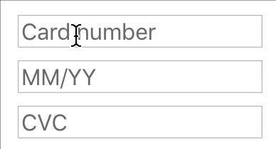
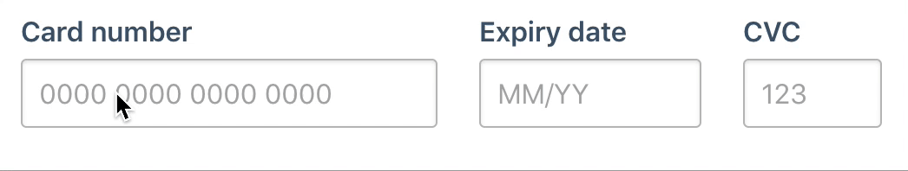
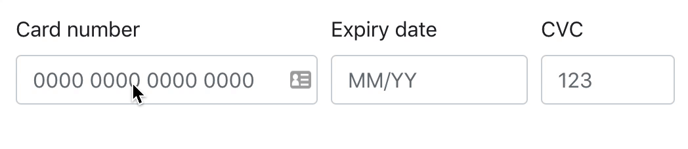

# React Payment Inputs

> A zero-dependency React Hook & Container to help with payment card input fields.

<p align="center"></img></p>

<p align="center"></img></p>

## Installation

```
npm install react-payment-inputs --save
```

or install with [Yarn](https://yarnpkg.com) if you prefer:

```
yarn add react-payment-inputs
```

## Usage

<p align="center"></img></p>

By default (as seen above), React Payment Inputs does not come with built-in styling. If you would like to use the built-in styles as seen in the animation above, [read "Using the built-in styled wrapper"](#using-the-built-in-styled-wrapper).

### With hooks

If you'd like to use the hooks version of React Payment Inputs, you can import `usePaymentInputs` into your component.

```jsx
import React from 'react';
import { usePaymentInputs } from 'react-payment-inputs';

export default function PaymentInputs() {
  const { meta, cardNumberProps, expiryDateProps, cvcProps } = usePaymentInputs();
  return (
    <div>
      <input {...cardNumberProps()} />
      <input {...expiryDateProps()} />
      <input {...cvcProps()} />
      {meta.isTouched && meta.error && <span>Error: {meta.error}</span>}
    </div>
  );
}
```

> By spreading props on the inputs as shown above, React Payment Inputs will automatically handle the formatting, focus & validation logic for you.

### With render props

If you'd like to use the render props version of React Payment Inputs, you can import `PaymentInputsContainer` into your component.

```jsx
import React from 'react';
import { PaymentInputsContainer } from 'react-payment-inputs';

export default function PaymentInputs() {
  return (
    <PaymentInputsContainer>
      {({ meta, cardNumberProps, expiryDateProps, cvcProps }) => (
        <div>
          <input {...cardNumberProps()} />
          <input {...expiryDateProps()} />
          <input {...cvcProps()} />
          {meta.isTouched && meta.error && <span>Error: {meta.error}</span>}
        </div>
      )}
    </PaymentInputsContainer>
  );
}
```

### Using the built-in styled wrapper

By default, React Payment Inputs does not have built-in styling for it's inputs. However, React Payment Inputs comes with a styled wrapper which combines the card number, expiry & CVC fields seen below:

<p align="center"></img></p>

```jsx
import React from 'react';
import { PaymentInputsWrapper, usePaymentInputs } from 'react-payment-inputs';
import images from 'react-payment-inputs/images';

export default function PaymentInputs() {
  const {
    wrapperProps,
    cardImageProps,
    cardNumberProps,
    expiryDateProps,
    cvcProps
  } = usePaymentInputs();
  return (
    <PaymentInputsWrapper {...wrapperProps}>
      <svg {...cardImageProps({ images })} />
      <input {...cardNumberProps()} />
      <input {...expiryDateProps()} />
      <input {...cvcProps()} />
    </PaymentInputsWrapper>
  );
}
```

### Using a third-party UI library

#### Fannypack

<p align="center"></img></p>

```jsx
import React from 'react';
import { FieldSet, InputField } from 'fannypack';
import { PaymentInputsWrapper, usePaymentInputs } from 'react-payment-inputs';
import images from 'react-payment-inputs/images';

export default function PaymentInputs() {
  const {
    meta,
    cardNumberProps,
    expiryDateProps,
    cvcProps
  } = usePaymentInputs();
  const { erroredInputs, touchedInputs } = meta;

  return (
    <FieldSet isHorizontal>
      <InputField
        {...cardNumberProps()}
        placeholder="0000 0000 0000 0000"
        label="Card number"
        inputRef={cardNumberProps().ref}
        state={erroredInputs.cardNumber && touchedInputs.cardNumber ? 'danger' : undefined}
        validationText={touchedInputs.cardNumber && erroredInputs.cardNumber}
        maxWidth="15rem"
      />
      <InputField
        {...expiryDateProps()}
        label="Expiry date"
        inputRef={expiryDateProps().ref}
        state={erroredInputs.expiryDate && touchedInputs.expiryDate ? 'danger' : undefined}
        validationText={touchedInputs.expiryDate && erroredInputs.expiryDate}
        maxWidth="8rem"
      />
      <InputField
        {...cvcProps()}
        placeholder="123"
        label="CVC"
        inputRef={cvcProps().ref}
        state={erroredInputs.cvc && touchedInputs.cvc ? 'danger' : undefined}
        validationText={touchedInputs.cvc && erroredInputs.cvc}
        maxWidth="5rem"
      />
    </FieldSet>
  );
}
```

#### Bootstrap

<p align="center"></img></p>

```jsx
import React from 'react';
import { FieldSet, InputField } from 'fannypack';
import { PaymentInputsWrapper, usePaymentInputs } from 'react-payment-inputs';
import images from 'react-payment-inputs/images';

export default function PaymentInputs() {
  const {
    meta,
    cardNumberProps,
    expiryDateProps,
    cvcProps
  } = usePaymentInputs();
  const { erroredInputs, touchedInputs } = meta;

  return (
    <Form>
      <Form.Row>
        <Form.Group as={Col} style={{ maxWidth: '15rem' }}>
          <Form.Label>Card number</Form.Label>
          <Form.Control
            {...cardNumberProps()}
            isInvalid={touchedInputs.cardNumber && erroredInputs.cardNumber}
            placeholder="0000 0000 0000 0000"
          />
          <Form.Control.Feedback type="invalid">{erroredInputs.cardNumber}</Form.Control.Feedback>
        </Form.Group>
        <Form.Group as={Col} style={{ maxWidth: '10rem' }}>
          <Form.Label>Expiry date</Form.Label>
          <Form.Control
            {...expiryDateProps()}
            isInvalid={touchedInputs.expiryDate && erroredInputs.expiryDate}
          />
          <Form.Control.Feedback type="invalid">{erroredInputs.expiryDate}</Form.Control.Feedback>
        </Form.Group>
        <Form.Group as={Col} style={{ maxWidth: '7rem' }}>
          <Form.Label>CVC</Form.Label>
          <Form.Control
            {...cvcProps()}
            isInvalid={touchedInputs.cvc && erroredInputs.cvc}
            placeholder="123"
          />
          <Form.Control.Feedback type="invalid">{erroredInputs.cvc}</Form.Control.Feedback>
        </Form.Group>
      </Form.Row>
    </Form>
  );
}
```
